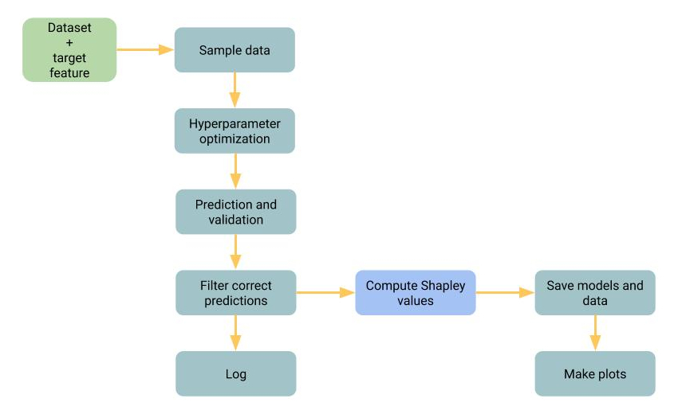

# AutoSHAP

AutoSHAP is a library still in development by the [Elo7](https://www.elo7.com.br) data science and search teams.

AutoSHAP is a simple framework built on top of [SHAP](https://github.com/slundberg/shap) to make it simple to engineers access explanations in a daily basis setting just a few parameters. It has two main classes, _FullPipeline_ and _SHAPViews_. The first runs the entire pipeline depicted in image bellow, i.e., it instances a [XGBoost](https://xgboost.readthedocs.io/en/latest/) model, makes hyperparameter optimization, computes the Shapley values with the best model, saves the XGBoost model and data and make plots as a result.

  
     
The second class, _SHAPViews_, allows one to see interactive plots of features and Shapley values. This is specially useful to analyze the distribution of some feature values while filtering them by some chosen Shapley Values.